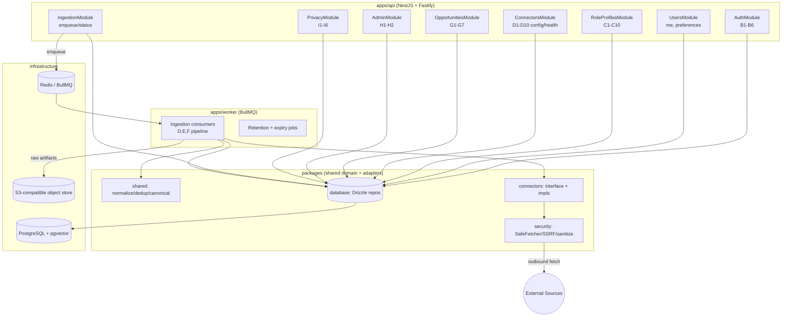
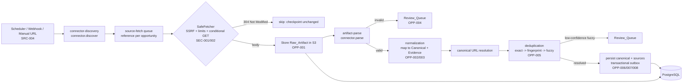
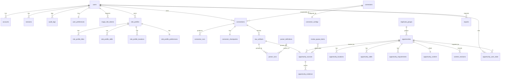

# Design Document: foundation-discovery-core

## Overview

`foundation-discovery-core` is the foundational slice of CareerRadar AI (working app name **CareerStack**). It establishes the application shell and public surface, passwordless authentication and sessions, role profiles, pluggable source connectors, the opportunity ingestion/processing pipeline, a read-only opportunity explorer with detail views, a basic admin connector-health view, and privacy/data-control operations.

This slice is deliberately the *substrate* for the whole platform. Later specs (matching engine, AI analysis, alerts, applications, documents, analytics) build on the canonical data model, ingestion pipeline, and browsing experience defined here. Accordingly, this design **reserves space** in the data model and UI for match/analysis without populating or displaying it (OPP-002.3, G6.5), and it treats several cross-cutting rules as non-negotiable **Hard_Blocker** invariants: never fabricate opportunity data (OPP-003.3), never store third-party platform passwords (SRC-009), never bypass access controls / cross-user isolation (PRIV-006).

### Requirement → capability map

| Capability | Requirements | Delivered by |
|---|---|---|
| A — Application Foundation & Public Surface | A1–A3 (R1–R3) | `config` package (`brandName`), `apps/web` public routes + PWA, authenticated app shell |
| B — Authentication & Sessions | B1–B6 (R4–R9) | `auth` package, `AuthModule`, `SessionModule`, `audit_logs` |
| C — Role Profiles | C1–C10 (R10–R19) | `RoleProfilesModule`, `role_profiles` + child tables |
| D — Source Connectors | D1–D10 (R20–R29) | `connectors` package, `ConnectorsModule`, `IngestionModule`, worker |
| E — Connector & Crawler Security | E1–E2 (R30–R31) | `security` package (`SafeFetcher`, SSRF guard) |
| F — Opportunity Processing | F1–F8 (R32–R39) | `IngestionModule`, normalization mapper, dedup engine, `opportunities` schema |
| G — Opportunity Explorer & Details | G1–G7 (R40–R46) | `OpportunitiesModule`, `apps/web` explorer + detail |
| H — Admin Connector-Health | H1–H2 (R47–R48) | `AdminModule`, `/admin` routes |
| I — Privacy & Data Control | I1–I6 (R49–R54) | `PrivacyModule`, ownership guards/repositories |
| J — Reliability & Graceful Degradation | J1–J2 (R55–R56) | Worker isolation, queues, status surfacing |
| K — Accessibility | K1 (R57) | `apps/web` + `ui` package (shadcn/ui, focus management) |
| L — Performance | L1 (R58) | List projections (no descriptions), indexes, pagination/virtualization |

### Guiding principles

- **Modular monolith with async workers.** API (`apps/api`) serves requests; ingestion runs in `apps/worker`. Both share domain logic through packages; domain logic is independent of controllers, decorators, and DB adapters so it stays unit-testable and reusable (SRC-001.2).
- **Evidence-based correctness.** Every extracted fact carries `Evidence`. The system marks facts uncertain rather than fabricating them (OPP-003).
- **Provenance is never lost.** Deduplication merges *representation* but retains every `Opportunity_Source` and its `Raw_Artifact` reference (OPP-006).
- **Idempotent, retryable, observable pipeline.** Every stage is keyed by content hash / dedup keys, is retryable with backoff, emits traces, and has a dead-letter queue (DLQ).

## Architecture

### Monorepo layout

pnpm workspaces + Turborepo, TypeScript `strict`.

```
careerstack/
├─ apps/
│  ├─ web/         # Next.js App Router (RSC + client islands), shadcn/ui, Tailwind
│  ├─ api/         # NestJS + Fastify HTTP API (/api/v1)
│  └─ worker/      # BullMQ consumers (ingestion pipeline, retention, expiry)
├─ packages/
│  ├─ ui/          # shared React components (design system on shadcn/ui)
│  ├─ database/    # Drizzle schema, migrations, repositories
│  ├─ contracts/   # shared Zod schemas + OpenAPI types (source of truth for I/O)
│  ├─ auth/        # session, OAuth/PKCE, magic-link, CSRF, guards (framework-agnostic core)
│  ├─ config/      # typed config loader incl. brandName, retention, rate limits
│  ├─ observability/ # logging, tracing, metrics, request/trace correlation
│  ├─ connectors/  # OpportunityConnector interface + Greenhouse/Lever/Ashby/JSON-LD
│  ├─ security/    # SafeFetcher, SSRF guard, HTML sanitizer, canonical URL
│  ├─ testing/     # fixtures, fast-check arbitraries, test harness
│  └─ shared/      # pure domain logic: normalization, dedup, canonicalization, errors
└─ infra/          # docker-compose (postgres+pgvector, redis, minio), migrations runner
```

**Boundary rule (SRC-001.2, RES-001):** `packages/shared` and `packages/connectors` contain pure domain logic and MUST NOT import NestJS, Fastify, Next.js, Drizzle, or `ioredis`. Adapters (repositories, queue clients, HTTP) live in `packages/database`, the worker, and the API. This keeps normalization, dedup, canonicalization, and the SSRF guard independent and property-testable.

### NestJS module boundaries



- **AuthModule** — Google OAuth (state+PKCE), email magic link, session issue/rotate/revoke, CSRF, admin role guard, auth auditing (R4–R9).
- **UsersModule** — `/me`, theme/preferences persistence (A3.5, A3.6).
- **RoleProfilesModule** — CRUD, activate/pause/duplicate, ownership enforcement (R10–R19).
- **ConnectorsModule** — list connector types, create/pause/remove connections, connection health, checkpoints (R20–R28, R51).
- **IngestionModule** — enqueue discovery/manual-URL jobs, expose run + long-running status (R24, R56); the actual processing runs in the worker.
- **OpportunitiesModule** — explorer list (projected, no descriptions), detail (+ source history/evidence), save/dismiss (R40–R46).
- **AdminModule** — connector health, runs, parser failures, review queue; admin-guarded + audited (R47–R48).
- **PrivacyModule** — export, delete data/account, disconnect OAuth source, retention policy surface (R49–R54).

### High-level ingestion flow



Every stage is **idempotent** (keyed by `content_hash` and dedup keys), **retryable** (exponential backoff), **observable** (structured logs + metrics), **trace-correlated** (a `trace_id`/`correlation_id` propagates from discovery through persistence and is stored on `raw_artifacts`), and **DLQ-backed** (exhausted retries land in a per-queue dead-letter set). A connector throwing an error is captured against its `Connection` without terminating the worker (SRC-001.4, RES-001).

## Components and Interfaces

> **Canonical type conventions (single source of truth).** To eliminate the earlier drift between two type passes, this design fixes ONE convention:
> - `SourceType` is a **string-literal union with lowercase values** (`'greenhouse' | 'lever' | 'ashby' | 'jsonld' | 'manual_url'`, plus reserved `'gmail'`). The Postgres `source_type` enum uses **the same lowercase values**, so app types and DB enums are identical.
> - `ExtractionMethod` uses the **uppercase** values mandated by the glossary/OPP-003 (`STRUCTURED_DATA | RULE | PARSER | LLM | USER`).
> - The connector exposes a **single** interface (`OpportunityConnector`) with `discover()` returning an `AsyncIterable<DiscoveryRef>` (streaming pagination). There is exactly one `ParsedOpportunity` shape (evidence-wrapped fields) and one application-layer `Opportunity`/`Evidence` shape (below).
> - Canonical stored `status` is the subset `{New, Active, Closing soon, Closed, Expired, Removed, Needs review, Duplicate}`; the per-user labels `Saved`/`Dismissed` (and reserved, out-of-scope `Applied`) are overlaid at display time from `opportunity_user_state`. The **display vocabulary** is the full fixed set of Requirement 46.

### 1. Connector Framework (`packages/connectors`)

The connector framework (Req 20, `SRC-001`) defines one interface every source implements. The core scheduler runs, monitors, and checkpoints any connector without source-specific handling (SRC-001.3). Implementations receive a `SafeFetcher` and `Logger` by injection so they never open sockets directly.

```ts
export type SourceType =
  | 'greenhouse'
  | 'lever'
  | 'ashby'
  | 'jsonld'        // generic schema.org JobPosting career page
  | 'manual_url'    // user-submitted single URL (SRC-004)
  | 'gmail';        // RESERVED: future spec, never implemented in this slice
// Extension points (future specs): 'sitemap' | 'rss' | 'browser_capture' | 'aggregator_*'

export type ExtractionMethod = 'STRUCTURED_DATA' | 'RULE' | 'PARSER' | 'LLM' | 'USER';

/** A reference discovered on a source, before fetch. */
export interface DiscoveryRef {
  sourceType: SourceType;
  externalId: string;          // stable id within the source (e.g., ATS posting id) — exact-identity dedup + idempotency
  url: string;                 // absolute URL to fetch
  dedupKey: string;            // stable key so re-discovery does not re-enqueue duplicates
  discoveredAt: string;        // ISO-8601
  hints?: Record<string, string>; // e.g., updated_at, board token, apply-url hint
}

/** Transport-level result of a single fetch (distinct from the persisted RawArtifact entity). */
export interface FetchResult {
  finalUrl: string;            // URL after redirects
  status: number;              // 200 or 304
  notModified: boolean;        // true when a conditional GET short-circuits (SRC-007.3)
  headers: Record<string, string>; // includes ETag / Last-Modified
  contentType: string;
  body: Buffer;                // capped at maxBytes (empty when notModified)
  byteSize: number;
  etag?: string;
  lastModified?: string;
}

/** One extracted fact carrying its provenance (OPP-003). */
export interface EvidenceValue<T> {
  value: T;
  evidence: {
    rawArtifactId: string;     // OPP-003.1
    sourceText: string;        // exact snippet the value came from
    method: ExtractionMethod;  // OPP-003.2
    confidence: number;        // 0..1
  };
  uncertain?: boolean;         // true when the fact could not be determined (OPP-003.4)
}

/** Parsed opportunity BEFORE normalization. Every field is optional + evidence-wrapped;
 *  facts absent from the source stay undefined and are NEVER fabricated (OPP-003.3). */
export interface ParsedOpportunity {
  title?: EvidenceValue<string>;
  company?: EvidenceValue<string>;
  locations?: EvidenceValue<string>[];
  workArrangement?: EvidenceValue<string>;
  employmentType?: EvidenceValue<string>;
  seniority?: EvidenceValue<string>;
  salary?: EvidenceValue<{ min?: number; max?: number; currency?: string; period?: string }>;
  postedAt?: EvidenceValue<string>;
  closesAt?: EvidenceValue<string>;
  descriptionHtml?: EvidenceValue<string>; // sanitized downstream, never rendered raw
  applyUrl?: EvidenceValue<string>;
  canonicalUrlHint?: EvidenceValue<string>;
  requirements?: EvidenceValue<string>[];
  skills?: EvidenceValue<string>[];
  closureSignal?: 'open' | 'closed' | 'removed' | 'unknown'; // OPP-007
}

export interface Checkpoint {
  cursor?: string;                       // pagination position / last successful state (SRC-007.1)
  etags?: Record<string, string>;        // per-url ETag for conditional GET (SRC-007.3)
  lastModified?: Record<string, string>;
  lastSuccessfulAt?: string;
}

export interface HealthStatus {
  status: 'healthy' | 'degraded' | 'failing' | 'unknown';
  message?: string;            // e.g., "no valid JobPosting JSON-LD found"
  consecutiveFailures: number;
  lastCheckedAt: string;
}

export interface ConnectorContext {
  connectionId: string;
  config: Record<string, unknown>;   // board slug / domain / options
  fetcher: SafeFetcher;              // the ONLY way a connector may reach the network
  logger: Logger;
  correlationId: string;
  signal: AbortSignal;
}

export interface OpportunityConnector {
  readonly sourceType: SourceType;
  readonly isFirstParty: boolean;    // greenhouse/lever/ashby/jsonld = true (SRC-002.3, SRC-003.3)

  discover(ctx: ConnectorContext, checkpoint: Checkpoint): AsyncIterable<DiscoveryRef>;
  fetch(ctx: ConnectorContext, ref: DiscoveryRef, checkpoint: Checkpoint): Promise<FetchResult>;
  parse(ctx: ConnectorContext, artifact: FetchResult): Promise<ParsedOpportunity>;
  healthCheck(ctx: ConnectorContext): Promise<HealthStatus>;
  getCheckpoint(ctx: ConnectorContext): Promise<Checkpoint | null>;
  saveCheckpoint(ctx: ConnectorContext, checkpoint: Checkpoint): Promise<void>;
}
```

**Concrete connectors (SRC-002, SRC-003, SRC-004):**

- **GreenhouseConnector** — official public JSON: `https://boards-api.greenhouse.io/v1/boards/{slug}/jobs?content=true`. `discover` pages the jobs list; `parse` maps structured JSON (title, location, updated_at, content HTML, absolute_url) with `method: STRUCTURED_DATA`. `isFirstParty = true`.
- **LeverConnector** — official public JSON: `https://api.lever.co/v0/postings/{slug}?mode=json` (text, categories, hostedUrl, createdAt). `isFirstParty = true`.
- **AshbyConnector** — official public job-board API (posting list + posting detail). `isFirstParty = true`.
- **JsonLdConnector** — fetches a career page, extracts `<script type="application/ld+json">`, selects `@type: JobPosting` nodes (schema.org), maps `title`, `hiringOrganization`, `jobLocation`, `datePosted`, `validThrough`, `employmentType`, `baseSalary`, `description`. If no valid JobPosting JSON-LD is present, records a health issue and **fabricates nothing** (SRC-003.2). `isFirstParty = true`.
- **ManualUrlConnector** — single-URL fetch; uses the JSON-LD path when present, otherwise best-effort `PARSER`. On parse/validation failure, stores the raw artifact and routes to the Review_Queue (SRC-004.2). Applies the same SafeFetcher controls (SRC-004.3). `isFirstParty` derives from the resolved domain.

**Extension:** a new source implements `OpportunityConnector`, registers a `SourceType` in the connector registry, and requires **no** changes to the scheduler, pipeline, rate limiter, or DLQ handling (SRC-001.3).

### 2. Safe HTTP Fetch Service (`packages/security`)

The single outbound HTTP chokepoint (Req 23.3, 27, 30, 31; `SEC-001`/`SEC-002`). **No connector may fetch except through it.**

```ts
export interface SafeFetchOptions {
  method?: 'GET' | 'HEAD';
  headers?: Record<string, string>;
  allowedContentTypes: string[]; // SEC-002.6 (per-connector allow set)
  maxBytes: number;              // SEC-002.4
  timeoutMs: number;             // SEC-002.5
  maxRedirects: number;          // SEC-002.3
  conditional?: { etag?: string; lastModified?: string }; // SRC-007.3
  domainPolicy: { allow?: string[]; deny?: string[] };    // SEC-002.7 (deny beats allow)
  respectRobots: boolean;        // SEC-002.2
}

export interface SafeFetcher {
  fetch(url: string, opts: SafeFetchOptions): Promise<FetchResult>;
}
```

Enforcement pipeline inside `SafeFetcher.fetch()`:

1. **Domain policy** — reject denied domains before DNS; deny-list beats allow-list (SEC-002.7).
2. **Robots** — honor robots directives where applicable, cached per host (SEC-002.2).
3. **DNS resolve + SSRF guard (SEC-001).** Resolve host, reject if *any* resolved IP is private (`10/8`, `172.16/12`, `192.168/16`), loopback (`127/8`, `::1`), link-local (`169.254/16`, `fe80::/10`), unique-local (`fc00::/7`), reserved/unspecified/multicast, or cloud metadata (`169.254.169.254`, `fd00:ec2::254`). **Pin** the connection to the validated IP (anti DNS-rebinding).
4. **Descriptive User-Agent** attached (SEC-002.1).
5. **Conditional headers** — send `If-None-Match`/`If-Modified-Since` from checkpoint; a `304` short-circuits with `notModified: true` (SRC-007.3).
6. **Request** with `timeoutMs`; abort on timeout (SEC-002.5).
7. **Redirects** — cap at `maxRedirects`; **re-run the SSRF guard on every redirect target** (SEC-001.3).
8. **Content-Type** — reject if not in `allowedContentTypes` (SEC-002.6).
9. **Size** — stream with a hard `maxBytes` cap; abort if `Content-Length` or streamed bytes exceed it (SEC-002.4).

**Per-domain rate limiting (SRC-008):** Redis token-bucket keyed by registrable domain, shared across all connections targeting that domain (27.1). Over-budget requests are **deferred** (re-enqueued with delay), never dropped (27.2). Throttling/5xx trigger exponential backoff with jitter up to a max attempt count, after which the job lands in the DLQ (27.3).

`SafeFetcher` is also the enforcement point for the Hard_Blockers (SRC-009): no credential injection, no CAPTCHA/anti-bot bypass, no authenticated/private fetch, and **no auto-apply code path exists anywhere in the system**.

### 3. Normalization mapper (`packages/shared`)

Pure function `normalize(parsed: ParsedOpportunity, source: SourceMeta): NormalizationResult`. Maps connector-specific `ParsedOpportunity` into `Canonical_Opportunity` field values, each accompanied by `Evidence`. Invariants:

- Never fabricates values for salary, work-rights, requirements, or closing dates absent from the source (OPP-003.3); missing → field omitted / marked `uncertain`, not a guessed default (OPP-003.4).
- Emits one `Evidence` record per populated fact, with `method` and confidence.
- Leaves match/analysis fields untouched (OPP-002.3).
- **Canonical URL resolution** — resolve to the stable first-party URL where possible, strip tracking params, normalize scheme/host casing; used as an identity key.
- **Field normalization** — title (lowercase, strip seniority/location noise into structured fields, collapse whitespace, map synonyms); location (`{city, region, country, isRemote}`, Australia-focused gazetteer with fallbacks); workplace/employment/seniority map onto the fixed enums below; salary parsed from source text only when present.

### 4. Deduplication engine (`packages/shared`)

Pure, three-stage cascade over `Opportunity_Source` candidates producing canonical assignments (OPP-005). It is **deterministic, idempotent, and order-independent** (see Correctness Properties).

1. **Exact-identity (OPP-005.1)** — same `(source_type, external_id)`, identical canonical URL, apply URL, or `(ats_board, ats_posting_id)` ⇒ same opportunity. Partly enforced by the `unique(source_type, external_id)` constraint.
2. **Normalized-fingerprint** — `fingerprint = sha256(normalized_company | normalized_title | normalized_location | employment_type | posting_date_bucket)`; equal fingerprints merge. Deterministic and order-independent for its inputs.
3. **Fuzzy** — embedding-free similarity (title Jaro-Winkler + company match + location proximity + description shingles) → confidence score. `confidence ≥ mergeThreshold` ⇒ merge; below ⇒ route to `review_queue_items` (`uncertain_duplicate`), never auto-merge (OPP-005.3).

**Canonical-source preference (OPP-005.4):** when a group mixes First_Party and aggregator records, canonical field values are taken from a First_Party source (then higher evidence confidence, then most recent); aggregator records remain linked as `opportunity_sources` for traceability (OPP-006).

### 5. Canonical Opportunity & Evidence types (application layer)

The single application-layer shape used by the API and explorer:

```ts
export type WorkArrangement = 'on_site' | 'hybrid' | 'remote';
export type EmploymentType  = 'full_time' | 'part_time' | 'contract' | 'internship' | 'temporary';
export type Seniority       = 'intern' | 'junior' | 'mid' | 'senior' | 'lead' | 'principal' | 'executive';
export type SalaryPeriod    = 'hour' | 'day' | 'month' | 'year';

/** Canonical stored status (subset). Saved/Dismissed/Applied are display overlays, not stored here. */
export type CanonicalStatus =
  | 'New' | 'Active' | 'Closing soon' | 'Closed' | 'Expired' | 'Removed' | 'Needs review' | 'Duplicate';
/** Full display vocabulary (Req 46). 'Applied' is reserved/out-of-scope this slice. */
export type DisplayStatus = CanonicalStatus | 'Saved' | 'Applied' | 'Dismissed';

export interface Evidence {
  field: string;                 // canonical field this evidence supports
  rawArtifactId: string;         // OPP-003.1
  sourceText: string;
  method: ExtractionMethod;
  confidence: number;            // 0..1
  uncertain: boolean;            // OPP-003.4
}

export interface SalaryRange { min?: number; max?: number; currency?: string; period?: SalaryPeriod; }

export interface OpportunitySourceRef {
  id: string;
  sourceType: SourceType;
  externalId: string;
  sourceUrl: string;
  applyUrl?: string;
  isFirstParty: boolean;         // UX marker + first-party-wins (OPP-005.4, G6.3)
  rawArtifactId?: string;        // preserved reference (OPP-006.3)
  confidence?: number;
}

export interface Opportunity {
  id: string;
  title: string;
  company: string;
  canonicalUrl: string;
  applyUrl?: string;
  locations: string[];
  workArrangement?: WorkArrangement;
  employmentType?: EmploymentType;
  seniority?: Seniority;
  salary?: SalaryRange;                 // only if present in source (OPP-003.3)
  description?: string;                 // detail-only; EXCLUDED from list responses (OPP-002.4, PERF)
  status: CanonicalStatus;              // stored canonical status (G7)
  postedAt?: string;
  firstSeenAt: string;
  lastUpdatedAt: string;                // OPP-008.3, sort key
  closingAt?: string;
  isFirstParty: boolean;                // any contributing first-party source (G6.3)
  sources: OpportunitySourceRef[];      // >= 1 always (provenance, OPP-006)
  evidence: Evidence[];                 // OPP-003

  // --- Reserved for future match/analysis specs; NOT populated here (OPP-002.3, G6.5) ---
  matchScore?: never;
  analysis?: never;
}
```

### 6. Authentication & Authorization (`packages/auth`)

Passwordless only (Req 4, 5; no password auth, 5.5).

- **Google OAuth (AUTH-001)** — Authorization Code flow with **PKCE** and a signed, single-use **state** parameter (CSRF defense). Requests minimum scopes (`openid email profile`) only (4.1, 52, PRIV-004). Never stores the Google password (4.5). First success creates a `users` row bound to the verified identity in `accounts` (4.4).
- **Email magic link (AUTH-002)** — server generates a random token, stores only its **hash**, expiry ≤ 15 minutes, `used_at` for single-use (5.1, 5.3, 5.4). Valid/unexpired/unused link establishes a session; expired/used links are rejected with an offer to resend (5.3).
- **Session management (AUTH-003)** — server-side sessions referenced by a secure, HttpOnly, SameSite cookie (raw token only in the cookie; `token_hash` stored). Session id rotates on privilege change; records device/user-agent, approx IP-derived location, last-active. Users list and revoke individual sessions or "all others" (6.1–6.3). Timestamps shown in the user's timezone (6.4).
- **Admin role (AUTH-005)** — distinct `role` flag on `users`; admin-only routes guarded server-side, non-admins get an authorization error (8.2, 8.3); admin access to operational views is audited (8.4, 48.3).
- **Ownership enforcement (PRIV-006)** — the canonical enforcement point is the **repository layer**: every user-scoped query takes an `ownerId` and includes `WHERE user_id = :ownerId`, so a missing/foreign owner yields not-found/deny rather than leaking rows. A NestJS guard provides a second controller-level check. Applied to role profiles, saved/dismissed state, connections, exports, sessions (54.3).
- **Auth audit (AUTH-006)** — sign-in success/failure, session create/revoke, account deletion, admin access appended to `audit_logs`, attributable to an account and not editable through standard user actions (append-only; 9.4).

### 7. API (`apps/api`, contracts in `packages/contracts`)

Versioned under `/api/v1`. All request/response bodies are validated against shared **Zod** schemas that also emit **OpenAPI** (single source of truth). Cross-cutting middleware: request-ID assignment + echo (`X-Request-Id`, propagated as `correlation_id` into enqueued jobs), trace correlation, session auth + CSRF (double-submit token on state-changing requests), per-resource ownership guards (PRIV-006), `Idempotency-Key` handling for POST mutations (dedup via stored request hash), cursor pagination, and a standard error envelope.

Standard error envelope:

```json
{ "error": { "code": "FORBIDDEN", "message": "You do not have access to this resource.", "requestId": "req_01H...", "details": [] } }
```

Cursor pagination envelope:

```json
{ "data": [ /* items */ ], "page": { "nextCursor": "eyJ...", "hasMore": true } }
```

| Resource | Method + Path | Notes / Requirements |
|---|---|---|
| Auth | `POST /auth/oauth/google/start` | redirect w/ state+PKCE (AUTH-001, PRIV-004) |
| Auth | `GET /auth/oauth/google/callback` | validate state, exchange code, issue session (AUTH-001) |
| Auth | `POST /auth/magic-link` / `GET /auth/magic-link/verify` | send / consume single-use link (AUTH-002) |
| Auth | `POST /auth/logout` | revoke current session |
| Sessions | `GET /me/sessions`, `DELETE /me/sessions/{id}`, `DELETE /me/sessions?others=true` | list/revoke (AUTH-003) |
| Me | `GET /me`, `PATCH /me/preferences` | profile, theme, timezone (A3.5) |
| Role profiles | `GET/POST /role-profiles`, `GET/PATCH/DELETE /role-profiles/{id}` | ownership-checked (PROF-*) |
| Role profiles | `POST /role-profiles/{id}/activate` `/duplicate` `/pause` `/resume` | C1, C8, C9 |
| Opportunities | `GET /opportunities` | filters+sort+cursor; **no `description`** (G1–G3, PERF) |
| Opportunities | `GET /opportunities/{id}` | full detail + sources + evidence (G6) |
| Opportunities | `PUT/DELETE /opportunities/{id}/save`, `/dismiss` | per-user state (G4) |
| Sources | `GET /connectors`, `GET/POST /connections`, `PATCH/DELETE /connections/{id}` | pause/remove (SRC-005/006) |
| Sources | `POST /connections/{id}/run`, `POST /sources/manual-url` | enqueue (SRC-004, RES-002) |
| Sources | `POST /connections/{id}/disconnect` | revoke OAuth (PRIV-003) |
| Runs | `GET /connections/{id}/runs`, `GET /runs/{id}` | observable runs (SRC-005) |
| Admin | `GET /admin/connector-health`, `GET /admin/runs`, `GET /admin/review-queue`, `GET /admin/parser-failures` | admin-guarded + audited (H1,H2) |
| Privacy | `POST /privacy/export`, `GET /privacy/export/{id}` | async export + status (PRIV-001, RES-002) |
| Privacy | `POST /privacy/delete-account`, `POST /privacy/delete-data` | confirmation-gated (PRIV-002) |
| Live | `GET /events` | SSE: run status, opportunity changes, export status (RES-002) |

Explorer filter dimensions (41): opportunity type, roleProfileId, company, location, workArrangement, employmentType, seniority, source, postedAfter/Before, firstSeenAfter/Before, closesBefore, state (saved/dismissed/needsReview), freshness, duplicateGroupId. Sorts (42): `newest | newlyDiscovered | closingSoon | recentlyUpdated`.

### 8. Frontend (`apps/web`)

Next.js App Router; Server Components render initial data (RSC), client islands handle interactivity; TanStack Query manages the client cache and SSE-driven invalidation.

```
/                      landing (public, RSC)
/features /how-it-works /sources /security /privacy /terms   public info (Req 2.2, RSC)
/signin                Google + magic-link entry (client) (Req 4,5)
/app                   authenticated shell (Req 3)
  /app/opportunities            explorer card/list/table (Req 40-44)
  /app/opportunities/[id]       detail + source history + safe links (Req 45)
  /app/sources                  connections + runs + manual URL (Req 24-26)
  /app/profiles                 role profiles (Req 10-19)
  /app/settings/sessions        session list/revoke (Req 6)
  /app/settings/privacy         export, disconnect, delete (Req 49-51)
/admin/connector-health         admin-only (Req 47,48)
```

- **RSC vs client boundaries** — data-fetching list/detail pages render on the server for first paint and SEO of the public surface; mutations (save/dismiss, filters, command palette, theme) are client components. SSE (`/events`) invalidates cached queries.
- **App shell (Req 3)** — persistent sidebar (desktop) / bottom nav (mobile), **command palette** via keyboard shortcut + visible control, always-visible **Active_Role_Profile** indicator (3.4), **theme switcher** (light/dark/system, persisted, no full reload via `next-themes`) (3.5–3.6). Brand name from `config.brandName`; missing → default + config warning (A1.3).
- **Explorer (Req 40–44)** — card/list/table modes; switching view **preserves filters/sort/result set** (40.2); collections paginate/virtualize and **never include descriptions** (40.3–40.4). Save/dismiss are optimistic, per-user.
- **URL state (Req 44)** — filters + sort serialize to query params via a pure `encodeExplorerState`/`decodeExplorerState` pair (round-trippable); only filter/sort params are encoded, never another user's private state (44.3).
- **Opportunity detail (Req 45)** — full info + status; contributing sources with evidence; first-party contributors visibly marked; external links open via `rel="noopener noreferrer" target="_blank"` (session-isolated, 45.4); reserved region for future match/analysis (45.5). Status uses only the fixed label set (Req 46).
- **Timezone/date handling** — all timestamps rendered in the user's timezone (from `user_preferences.timezone`) with exact value on demand (6.4, 46.3); date math uses a single tz-aware formatter helper.
- **Required states** — every data surface defines **empty**, **loading** (skeleton), and **error** states; long-running actions (export, connector run, manual URL) show live status via SSE (RES-002).
- **Accessibility (Req 57, A11Y-001)** — WCAG 2.2 AA target; full keyboard nav incl. command palette; reduced-motion honoring; accessible dialog roles/labels/focus management.
- **PWA (Req 2.5)** — web app manifest + service worker offering an offline fallback shell for the public surface.

### 9. Background Jobs & Queues (`apps/worker`)

BullMQ queues, one per pipeline concern (SRC-001.2): `discovery`, `fetch`, `parse`, `normalize`, `dedup`, `expiry-check`, `retention-cleanup`, `outbox-dispatch`. Shared properties:

- **Idempotency** — job ids derive from stable keys (`dedupKey`, `rawArtifactId`, canonical id) so retries/duplicate enqueues collapse.
- **Backoff + retry limits** — exponential backoff with jitter; exhausted retries move to the queue's **DLQ** and the failure reason is recorded on the `connector_run` (24.3, 27.3).
- **Per-domain concurrency** — fetch jobs are grouped by registrable domain honoring the shared rate limiter (27).
- **Per-user quotas** — manual submissions and connection runs are bounded per user to prevent abuse.
- **Correlation IDs** threaded end-to-end for tracing.
- **Graceful shutdown** — on SIGTERM workers stop accepting new jobs and finish or safely re-queue in-flight work (ECS task drain).
- **Scheduling** — a scheduler triggers recurring `discovery` per active, non-paused Connection; paused/removed connections are not scheduled (SRC-006).
- **Expiry/closure (OPP-007)** — `expiry-check` detects closed/removed postings and sets status; ambiguous closure is marked uncertain, not asserted (38.2).
- **Retention (PRIV-005)** — `retention-cleanup` deletes/anonymizes raw artifacts past the configurable window while keeping canonical opportunities accessible (53.2–53.3).
- **Transactional outbox** — state + events are committed atomically; `outbox-dispatch` publishes at-least-once.

## Data Models

PostgreSQL via **Drizzle ORM**. Conventions across all tables:

- Primary keys are `uuid` (default `gen_random_uuid()`); `created_at`/`updated_at timestamptz not null default now()` (trigger-maintained) on mutable tables.
- Foreign keys are explicit with appropriate `on delete` behavior; user-owned tables carry `user_id` for DB-level ownership and are indexed on it (PRIV-006).
- Postgres enum types encode fixed value sets. `source_type` enum uses the **same lowercase values** as the `SourceType` TS union (`greenhouse | lever | ashby | jsonld | manual_url`, reserved `gmail`); `extraction_method` uses the uppercase glossary set.
- `pgvector` extension is created; the reserved `embedding`/`match_features` columns on `opportunities` are **declared but never written** in this slice (OPP-002.3).
- Explicit unique constraints provide idempotency. Match/analysis is reserved **inline on `opportunities`** (no separate embeddings table), keeping one canonical row per opportunity.

### Entity-relationship overview



### Identity, Sessions, Preferences, Audit

```
users
  id uuid pk
  email text unique not null                -- citext
  display_name text
  email_verified_at timestamptz
  role text not null default 'user'         -- 'user' | 'admin' (Req 8)
  status text not null default 'active'     -- 'active' | 'deleted'
  timezone text                             -- UX date rule (Req 6.4, 46.3)
  anonymized_at timestamptz                 -- soft-delete/anonymize marker (Req 7, 50)
  deleted_at timestamptz
  created_at, updated_at

accounts                                    -- external identities (OAuth)
  id uuid pk
  user_id uuid fk -> users(id) on delete cascade
  provider text not null                    -- 'google'
  provider_account_id text not null         -- verified subject (Req 4.4)
  access_token_enc bytea                     -- KMS-encrypted; minimal scope (Req 52); nullable
  refresh_token_enc bytea
  scopes text[]                             -- recorded to enforce minimization
  connected_at timestamptz
  unique(provider, provider_account_id)
  -- NOTE: NEVER stores third-party passwords (Req 4.5, 28) — no password column exists

magic_link_tokens
  id uuid pk
  user_id uuid fk -> users(id) on delete cascade    -- or pending email for first sign-in
  email text not null
  token_hash text unique not null           -- store hash only (Req 5)
  expires_at timestamptz not null           -- <= created_at + 15m (Req 5.4)
  used_at timestamptz                        -- single-use (Req 5.3)
  created_at
  index(token_hash)

sessions
  id uuid pk
  user_id uuid fk -> users(id) on delete cascade
  token_hash text unique not null           -- raw token only in cookie
  user_agent text
  ip_hash text                               -- approx location, not raw IP
  approx_location text
  last_active_at timestamptz not null
  rotated_from uuid                          -- rotation lineage (AUTH-003)
  revoked_at timestamptz                     -- revocation (Req 6.2/6.3)
  expires_at timestamptz not null
  created_at
  index(user_id), index(user_id, revoked_at)

user_preferences
  user_id uuid pk fk -> users(id) on delete cascade
  theme text not null default 'system'      -- 'light'|'dark'|'system' (Req 3.5)
  timezone text
  active_role_profile_id uuid fk -> role_profiles(id) on delete set null  -- exactly one active (Req 10.2)
  raw_retention_days int                     -- per-user override of retention (Req 53.1)
  updated_at

audit_logs                                  -- append-only (Req 9.4); auth + admin events
  id uuid pk
  user_id uuid                               -- attributable (nullable for failed email sign-ins)
  actor text                                 -- 'user'|'admin'|'system'
  event_type text not null                   -- login_success|login_failure|session_created|
                                             -- session_revoked|account_deleted|admin_access
  method text                                -- 'google'|'magic_link'
  outcome text
  target_ref text                            -- resource touched (e.g., review-queue)
  metadata jsonb
  ip_hash text
  created_at
  index(user_id, created_at)
  -- no UPDATE/DELETE grants via app role; INSERT-only
```

### Role Profiles

Child tables (not JSONB) for titles/skills/locations: they are queried/filtered relationally by the explorer and future matching, benefit from indexing/integrity, and stay small per user. Scalar preference sets live in `role_profile_preferences`; genuinely schemaless bits use JSONB.

```
role_profiles
  id uuid pk
  user_id uuid fk -> users(id) on delete cascade     -- ownership (Req 10.5, 54)
  name text not null
  status text not null default 'active'               -- 'active' | 'paused' (Req 18)
  salary_min numeric, salary_max numeric,             -- optional; unspecified != 0 (Req 15.3)
  salary_currency text, salary_period text
  work_rights jsonb                                   -- optional, PRIVATE (Req 16); null = unspecified
  created_at, updated_at
  index(user_id)
  -- "exactly one active" modeled via user_preferences.active_role_profile_id (single source of truth)

role_profile_titles
  id uuid pk
  role_profile_id uuid fk -> role_profiles(id) on delete cascade
  kind text not null            -- 'target' | 'excluded' (Req 11)
  value text not null
  index(role_profile_id, kind)

role_profile_skills
  id uuid pk
  role_profile_id uuid fk -> role_profiles(id) on delete cascade
  kind text not null            -- 'required' | 'preferred' (Req 12)
  value text not null
  index(role_profile_id, kind)

role_profile_locations
  id uuid pk
  role_profile_id uuid fk -> role_profiles(id) on delete cascade
  value text not null           -- (Req 13.1)
  is_primary boolean not null default false
  index(role_profile_id)

role_profile_preferences        -- singleton-per-profile scalar sets
  role_profile_id uuid pk fk -> role_profiles(id) on delete cascade
  work_arrangements text[]      -- subset of {on_site,hybrid,remote} (Req 13.2)
  employment_types text[]       -- (Req 14.1)
  seniority_levels text[]       -- (Req 14.2)
```

### Connectors, Connections, Runs, Checkpoints

```
connectors                       -- static registry of available connector types
  id uuid pk
  source_type source_type not null          -- enum: greenhouse|lever|ashby|jsonld|manual_url
  display_name text not null
  is_first_party boolean not null            -- (Req 21.3, 22.3)
  default_config jsonb
  unique(source_type)

connector_configs                -- default/global fetch config per connector type
  connector_id uuid pk fk -> connectors(id)
  rate_limit_per_min int not null
  max_bytes int not null, timeout_ms int not null, max_redirects int not null
  allowed_content_types text[] not null
  default_schedule text          -- cron-like

connections                      -- user-configured running instance (Req 20)
  id uuid pk
  user_id uuid fk -> users(id) on delete cascade      -- ownership (Req 54)
  connector_id uuid fk -> connectors(id)
  source_type source_type not null
  config jsonb not null          -- board slug / domain / URL
  status text not null default 'active'   -- 'active'|'paused'|'removed' (Req 25)
  health_status text default 'unknown'    -- 'healthy'|'degraded'|'failing'|'unknown' (Req 22.2, 24)
  last_health_reason text
  consecutive_failures int not null default 0
  oauth_account_id uuid fk -> accounts(id) on delete set null  -- OAuth sources (Req 51)
  created_at, updated_at
  index(user_id), index(status)

connector_runs                   -- observable runs (Req 24)
  id uuid pk
  connection_id uuid fk -> connections(id) on delete cascade
  correlation_id text not null
  status text not null           -- 'running'|'succeeded'|'failed'
  started_at timestamptz not null, finished_at timestamptz
  items_discovered int default 0, items_fetched int default 0,
  items_parsed int default 0, items_persisted int default 0, items_failed int default 0
  failure_reason text            -- (Req 24.3)
  index(connection_id, started_at)

connector_checkpoints            -- resumable state (Req 26)
  connection_id uuid pk fk -> connections(id) on delete cascade
  cursor text, etags jsonb, last_modified jsonb
  last_successful_at timestamptz
```

### Raw Artifacts & Parsers

```
raw_artifacts                    -- stored BEFORE parsing (Req 32)
  id uuid pk
  connection_id uuid fk -> connections(id) on delete set null
  source_type source_type not null
  source_url text not null
  fetched_at timestamptz not null        -- (Req 32.2)
  http_status int, content_type text
  headers jsonb                          -- includes ETag/Last-Modified
  storage_key text not null              -- body in S3 (signed-URL access only)
  content_hash text not null             -- sha256 for change detection + idempotency (Req 39)
  byte_size int
  etag text, last_modified text
  retention_until timestamptz            -- configurable retention (Req 53)
  deleted_at timestamptz                  -- retention removal marker (Req 53.2)
  correlation_id text
  unique(connection_id, source_url, content_hash)   -- fetch idempotency (OPP-001)
  index(connection_id, fetched_at), index(content_hash), index(retention_until)

parser_definitions               -- versioned parser per source type
  id uuid pk
  source_type source_type not null
  version int not null
  active boolean not null default true
  unique(source_type, version)

parser_runs                      -- parse attempt + outcome (Req 48)
  id uuid pk
  raw_artifact_id uuid fk -> raw_artifacts(id) on delete cascade
  parser_definition_id uuid fk -> parser_definitions(id)
  correlation_id text
  status text not null           -- 'succeeded'|'validation_failed'|'parse_failed'
  failure_reason text            -- (Req 35.3, 48.1)
  created_at
  index(raw_artifact_id)
```

### Canonical Opportunity Model & Provenance

```
opportunities                    -- Canonical_Opportunity (Req 33)
  id uuid pk
  title text not null
  company text not null
  canonical_url text unique      -- resolved canonical URL (dedup/identity)
  apply_url text
  work_arrangement text          -- normalized enum: on_site|hybrid|remote (Req 33.2)
  employment_type text
  seniority text
  salary_min numeric, salary_max numeric, salary_currency text, salary_period text
  posted_at timestamptz, first_seen_at timestamptz not null, closing_at timestamptz
  last_updated_at timestamptz not null    -- surfaced for sort (Req 39.3)
  status opportunity_status not null default 'New'
     -- enum: New|Active|Closing soon|Closed|Expired|Removed|Needs review|Duplicate
     -- (Saved/Applied/Dismissed are per-user display overlays, not canonical status)
  is_first_party boolean not null default false
  fingerprint text               -- normalized-fingerprint dedup key
  content_hash text              -- of canonical content for change detection (Req 39)
  duplicate_group_id uuid fk -> duplicate_groups(id) on delete set null
  -- RESERVED, unused this slice (Req 33.3, 45.5):
  match_features jsonb           -- reserved for future match/analysis
  embedding vector(1536)         -- pgvector, reserved for future matching
  created_at, updated_at
  index(status), index(company), index(posted_at), index(first_seen_at),
  index(closing_at) where closing_at is not null, index(last_updated_at), index(fingerprint)
  index(status, last_updated_at desc)                       -- primary explorer sort (Req 41,42,58)
  index(company, status)
  partial index where status in ('New','Active','Closing soon') on (last_updated_at desc)

opportunity_locations
  id uuid pk
  opportunity_id uuid fk -> opportunities(id) on delete cascade
  value text not null, normalized_value text
  city text, region text, country text, is_remote boolean
  index(opportunity_id), index(normalized_value), index(country, region, city)

opportunity_requirements
  id uuid pk
  opportunity_id uuid fk -> opportunities(id) on delete cascade
  value text not null

opportunity_skills
  id uuid pk
  opportunity_id uuid fk -> opportunities(id) on delete cascade
  value text not null
  kind text                       -- nullable; reserved for future extraction
  index(opportunity_id)

opportunity_content              -- full description kept OUT of list responses (Req 33.4, 40.3, 58.3)
  opportunity_id uuid pk fk -> opportunities(id) on delete cascade
  description_html_sanitized text        -- sanitized; NEVER rendered raw (XSS defense)
  description_text text

opportunity_sources              -- traceability after merge (Req 37)
  id uuid pk
  opportunity_id uuid fk -> opportunities(id) on delete cascade
  raw_artifact_id uuid fk -> raw_artifacts(id) on delete set null   -- preserve reference (Req 37.3)
  source_type source_type not null
  is_first_party boolean not null        -- first-party-wins + UX marker (Req 21.4, 45.3)
  external_id text                       -- exact-identity dedup input (Req 36)
  source_url text, apply_url text, ats_board text, ats_posting_id text
  fingerprint text                       -- normalized-fingerprint dedup input
  confidence numeric
  created_at
  index(opportunity_id), index(fingerprint)
  unique(source_type, external_id)       -- exact-identity guard (OPP-005.1)

opportunity_evidence             -- provenance per extracted fact (Req 34, 45.2)
  id uuid pk
  opportunity_source_id uuid fk -> opportunity_sources(id) on delete cascade
  field text not null            -- e.g., 'salary','title','closingAt'
  value_json jsonb
  source_text text
  method extraction_method not null      -- STRUCTURED_DATA|RULE|PARSER|LLM|USER (Req 34.2)
  confidence numeric not null
  uncertain boolean not null default false -- (Req 34.4)
  index(opportunity_source_id)

content_revisions                -- change history (Req 39)
  id uuid pk
  opportunity_id uuid fk -> opportunities(id) on delete cascade
  changed_at timestamptz not null
  changed_fields text[]          -- which canonical fields changed (Req 39.2)
  previous_content_hash text, new_content_hash text
  raw_artifact_id uuid fk -> raw_artifacts(id) on delete set null
  index(opportunity_id, changed_at)

duplicate_groups                 -- (Req 36, 41.4)
  id uuid pk
  canonical_opportunity_id uuid fk -> opportunities(id) on delete set null
  strategy text                  -- 'exact'|'fingerprint'|'fuzzy'
  confidence numeric
  created_at
```

### Per-User State, Review Queue, Exports, Outbox, Flags

```
opportunity_user_state           -- saved/dismissed, scoped per user (Req 43)
  user_id uuid fk -> users(id) on delete cascade      -- ownership (Req 43.4, 54)
  opportunity_id uuid fk -> opportunities(id) on delete cascade
  state text not null            -- 'saved' | 'dismissed'  (absence = none)
  created_at, updated_at
  primary key(user_id, opportunity_id)                -- one state per user/opportunity
  index(user_id, state)

review_queue_items               -- invalid/uncertain records (Req 35, 48)
  id uuid pk
  kind text not null             -- 'invalid_record'|'uncertain_duplicate'|'closure_ambiguous'
  raw_artifact_id uuid fk -> raw_artifacts(id) on delete set null  -- artifact retained (Req 35.2)
  opportunity_source_id uuid fk -> opportunity_sources(id) on delete set null
  reason text                    -- failure/adjudication reason (Req 35.3)
  status text not null default 'open'   -- 'open'|'resolved'
  created_at
  index(status, created_at)

exports                          -- data export jobs (Req 49)
  id uuid pk
  user_id uuid fk -> users(id) on delete cascade      -- ownership (Req 49.2, 54)
  status text not null           -- 'pending'|'ready'|'failed' (Req 49.3)
  storage_key text               -- signed-URL delivery to owner only
  created_at, updated_at

outbox_events                    -- transactional outbox (reliability)
  id uuid pk
  aggregate_type text not null, aggregate_id uuid not null
  event_type text not null
  payload jsonb not null
  correlation_id text
  created_at timestamptz not null default now()
  published_at timestamptz
  index(published_at) where published_at is null       -- pending dispatch

feature_flags                    -- config-driven toggles (incl. future connector modes)
  key text pk
  enabled boolean not null default false
  payload jsonb
```

### Indexing strategy (PERF / L1, dedup)

- `opportunities`: `(status, last_updated_at desc)` primary explorer sort; `(company, status)`; partial index on active statuses; `(fingerprint)`, `(closing_at)`, `(first_seen_at)` for filters/dedup; `canonical_url` unique.
- `opportunity_locations(normalized_value)`; `opportunity_sources(source_type, external_id)` unique + `(fingerprint)`; `raw_artifacts(content_hash)`.
- `opportunity_user_state(user_id, state)` for saved/dismissed filters.
- List queries select a **projection without `description`** (OPP-002.4, L1.3) — description lives in `opportunity_content` and is joined only on detail.

## Correctness Properties

*A property is a characteristic or behavior that should hold true across all valid executions of a system — a formal statement about what the system should do. Properties bridge human-readable specifications and machine-verifiable correctness guarantees.* Each property below is universally quantified and implemented as a single property-based test (fast-check, ≥100 iterations). The pure domain logic in `packages/shared`, `packages/connectors`, and `packages/security` is the primary target; repository-backed properties use an in-memory or transactional test harness. Redundant criteria were consolidated during prework reflection (e.g., scope-minimality, no-fabrication, list-projection, ownership isolation, and the dedup family are each a single property or tight family).

### Property 1: Normalization never fabricates absent facts

*For any* `ParsedOpportunity`, `normalize()` produces a canonical record in which every populated field traces to a source-present fact carrying `Evidence` (with a valid `ExtractionMethod`), and any field absent from the source is either omitted or marked `uncertain` — never assigned a fabricated default. In particular salary, work-rights, requirements, and closing dates are never invented.
Generator: arbitrary `ParsedOpportunity` with a random subset of fields present. Oracle: for every canonical field, `present-in-output ⇒ present-in-input`; and every output value has ≥1 evidence entry whose `sourceText` is drawn from the input.
**Validates: Requirements 34.1, 34.2, 34.3, 34.4, 22.2**

### Property 2: Deduplication is deterministic, idempotent, and order-independent

*For any* set of `Opportunity_Source` records and any permutation of them, `dedup()` yields the same canonical grouping; and `dedup(dedup(S)) == dedup(S)`. Formally `merge(A,B) ≡ merge(B,A)` and any arrival order produces identical groups.
Generator: arbitrary source multiset; test all/random permutations. Oracle: grouping partition equality across permutations; second application is a fixpoint.
**Validates: Requirements 36.1, 36.2**

### Property 3: Exact-identity uniqueness on (source_type, external_id)

*For any* two `Opportunity_Source` records sharing the same `(source_type, external_id)` (or identical canonical URL), dedup always assigns them to the same `Canonical_Opportunity`, and the store never persists two canonical rows for one identity key.
Generator: arbitrary sources with deliberate identity collisions. Oracle: same canonical id; unique-constraint honored.
**Validates: Requirements 36.1, 36.2**

### Property 4: Fingerprint stability

*For any* two records whose normalized `(company, title, location, employment_type, posting_date_bucket)` are equal, their `fingerprint` is equal; and `fingerprint` is a pure deterministic function of those inputs (equal inputs ⇒ equal output, independent of ordering or unrelated fields).
Generator: arbitrary field tuples plus noise fields. Oracle: equality of fingerprints iff normalized inputs equal.
**Validates: Requirements 36.1**

### Property 5: First-party-wins canonical selection

*For any* duplicate group mixing First_Party and aggregator sources, every canonical field value is taken from a First_Party source (tie-broken by evidence confidence then recency); aggregator sources remain linked but do not supply canonical values when a first-party value exists.
Generator: arbitrary groups with ≥1 first-party and ≥1 aggregator source. Oracle: each canonical field's provenance is a first-party source when one supplies that field.
**Validates: Requirements 36.4, 21.4**

### Property 6: Low-confidence fuzzy matches are never auto-merged

*For any* candidate pair whose fuzzy similarity is below `mergeThreshold`, dedup does not merge them; instead a `review_queue_items` row (`uncertain_duplicate`) is produced.
Generator: pairs engineered to fall below threshold. Oracle: distinct canonical ids + a review item exists.
**Validates: Requirements 36.3**

### Property 7: Provenance preserved after merge

*For any* merge, the count and identity of contributing `Opportunity_Source` records are preserved after merging, and each retains its `raw_artifact` reference. No source is dropped.
Generator: arbitrary mergeable groups. Oracle: `sources(canonical)` (as a set) equals the union of inputs; each has a non-null `raw_artifact_id`.
**Validates: Requirements 37.1, 37.2, 37.3**

### Property 8: Per-user isolation invariant

*For any* two distinct users A and B and any user-owned resource of B (role profiles, saved/dismissed state, sessions, exports, connections, work-rights), a request made on behalf of A is denied/not-found by every user-scoped repository. A user's private state is never visible to another user.
Generator: arbitrary two-user datasets + arbitrary resource requests. Oracle: cross-owner access returns deny/not-found; same-owner access succeeds.
**Validates: Requirements 54.1, 54.2, 54.3, 10.5, 16.3, 19.4, 43.4, 49.2**

### Property 9: SSRF guard rejects all unsafe addresses (incl. on redirect)

*For any* URL whose resolved IP set intersects the blocklist (private, loopback, link-local, unique-local, reserved, or cloud-metadata), `SafeFetcher` rejects the request before sending a body; and the same check is re-applied to every redirect target so a safe→unsafe redirect is also rejected.
Generator: arbitrary IPs across all blocked ranges + redirect chains ending in blocked IPs. Oracle: rejection for any blocked address at any hop; allowed only when every hop is public.
**Validates: Requirements 30.1, 30.2, 30.3**

### Property 10: Safe-fetch bounds are enforced

*For any* fetch, a response exceeding `maxBytes` is aborted, a redirect chain longer than `maxRedirects` is aborted, a timeout beyond `timeoutMs` aborts the request, a content-type outside `allowedContentTypes` is rejected, and a domain on the deny-list is rejected even if also allow-listed (deny beats allow).
Generator: arbitrary sizes/redirect-counts/content-types/domain policies. Oracle: outcome matches the bound predicate for each dimension.
**Validates: Requirements 31.3, 31.4, 31.5, 31.6, 31.7**

### Property 11: Per-domain rate limit is never exceeded and defers rather than drops

*For any* arrival pattern of requests to a domain, the number dispatched within any window never exceeds the configured budget, and every over-budget request is deferred and eventually retried (none dropped).
Generator: arbitrary arrival bursts + budgets. Oracle: windowed dispatch count ≤ budget; deferred set is eventually drained.
**Validates: Requirements 27.1, 27.2, 27.3**

### Property 12: Magic-link lifecycle and expiry bound

*For any* issued magic-link token: (a) `expires_at − created_at ≤ 15 minutes`; (b) a valid, unexpired, unused token establishes a session and marks the token used; (c) an expired or already-used token is rejected and never establishes a session.
Generator: arbitrary issue/verify sequences over a controllable clock. Oracle: expiry bound holds; single-use enforced; expired/used → reject.
**Validates: Requirements 5.2, 5.3, 5.4**

### Property 13: OAuth requested scopes are minimal

*For any* OAuth start, the requested scope set is a subset of the allowed minimal set (`openid email profile`) and never includes out-of-scope capabilities.
Generator: arbitrary flow configs. Oracle: `requestedScopes ⊆ minimalScopes`.
**Validates: Requirements 4.1, 52.1, 52.2**

### Property 14: One active role profile invariant

*For any* sequence of role-profile operations (create, activate, duplicate, pause, resume, delete), the user has at most one Active_Role_Profile at all times, and exactly one whenever ≥1 profile exists after the first creation; duplicate leaves the active pointer unchanged and pause never leaves the active profile paused.
Generator: arbitrary op sequences. Oracle: active count ∈ {0,1}, and = 1 once any profile exists; invariants after each op.
**Validates: Requirements 10.1, 10.2, 10.3, 10.4, 17.2, 18.2**

### Property 15: Role profile persistence round-trips

*For any* role profile with arbitrary title/skill/location/employment/seniority facet sets and salary/work-rights, saving then loading returns equal facet sets; unspecified salary and work-rights remain null/unspecified (never defaulted to zero or inferred).
Generator: arbitrary role profiles including empty/unspecified fields. Oracle: `load(save(p)) == p` on facet sets; nulls preserved.
**Validates: Requirements 11.3, 12.3, 13.3, 14.3, 15.2, 15.3, 16.5, 17.1**

### Property 16: Idempotent ingestion and change detection

*For any* fetched content, a `raw_artifact` row is persisted before any `opportunity_source` is written; re-ingesting content with an identical `content_hash` creates no duplicate artifact, no `content_revision`, and does not advance `last_updated_at`; ingesting changed content creates exactly one `content_revision` listing the changed fields and advances `last_updated_at`. A `304 Not Modified` skips re-parse and mutates nothing.
Generator: arbitrary fetch sequences with repeats and mutations. Oracle: artifact-before-source ordering; idempotence on identical hash; single revision + advanced timestamp on change.
**Validates: Requirements 32.1, 32.2, 39.1, 39.2, 39.3, 26.2, 26.3**

### Property 17: Invalid/unparseable records route to the review queue with retained artifact

*For any* fetched artifact that fails to parse/validate against the canonical schema, the `raw_artifact` is retained and a `review_queue_item` is created with a non-empty reason; no partial/fabricated canonical opportunity is persisted for it.
Generator: arbitrary malformed/incomplete artifacts. Oracle: review item + retained artifact exist; no canonical row.
**Validates: Requirements 23.2, 35.1, 35.2, 35.3**

### Property 18: Closure is set only on definitive signals

*For any* source closure signal: a definitive `closed`/`removed` signal sets status to `Closed`/`Removed`; an ambiguous/unknown signal leaves status unchanged (not forced to `Closed`) and marks the fact uncertain; closed records remain retrievable.
Generator: arbitrary closure signals. Oracle: status transition matches signal definiteness; record still readable.
**Validates: Requirements 38.1, 38.2, 38.3**

### Property 19: List responses never include full descriptions

*For any* opportunity and any explorer list/collection query, the serialized list DTO/projection contains no `description` field; the description is present only via the detail endpoint.
Generator: arbitrary opportunities + list queries. Oracle: `description` key absent from every list item; present in detail DTO.
**Validates: Requirements 33.4, 40.3, 58.3, 45.1**

### Property 20: Explorer filtering is sound and complete

*For any* set of opportunities and any combination of active filters, every returned item satisfies all active predicates (soundness) and the result set is a subset of the unfiltered set; and every unfiltered item satisfying all predicates is returned (completeness).
Generator: arbitrary opportunity sets + filter combinations. Oracle: result set equals the reference in-memory filter over the same predicates.
**Validates: Requirements 41.1, 41.2, 41.3, 41.4, 41.5**

### Property 21: Sorting orders by the selected key together with filters

*For any* sort option (`newest | newlyDiscovered | closingSoon | recentlyUpdated`) and any filter set, the returned sequence is ordered by the corresponding key and contains exactly the filtered items.
Generator: arbitrary sets + sort/filter combinations. Oracle: output is a sorted permutation of the filtered set by the chosen key.
**Validates: Requirements 42.1, 42.2, 42.3, 40.2**

### Property 22: Pagination is complete and non-overlapping

*For any* result set and page size, concatenating all cursor pages reproduces the full ordered result exactly once — no duplicates and no gaps.
Generator: arbitrary result sizes + page sizes. Oracle: `concat(pages) == fullOrdered`.
**Validates: Requirements 40.4, 58.3**

### Property 23: Save/dismiss set/reverse round-trip, scoped per user

*For any* user and opportunity, saving then reversing clears the state (`none`); dismissing then reversing clears the state; the state is unique per `(user, opportunity)` and never leaks to other users.
Generator: arbitrary save/dismiss/reverse sequences across users. Oracle: final state matches last effective action; cross-user reads unaffected.
**Validates: Requirements 43.1, 43.2, 43.3, 43.4**

### Property 24: Explorer URL state round-trips and carries no private data

*For any* explorer state (filters + sort), `decodeExplorerState(encodeExplorerState(state)) == state`; and the encoded params contain only filter/sort keys — never user-private fields.
Generator: arbitrary explorer states. Oracle: round-trip identity + key-set ⊆ {filter, sort} keys.
**Validates: Requirements 44.1, 44.2, 44.3**

### Property 25: Display status is always within the fixed vocabulary

*For any* opportunity canonical status combined with any per-user overlay state, the computed display status is a member of the fixed label set {New, Active, Closing soon, Closed, Expired, Removed, Needs review, Duplicate, Saved, Applied, Dismissed}.
Generator: arbitrary (canonicalStatus, userState) pairs. Oracle: result ∈ fixed set (total function, no out-of-vocabulary label).
**Validates: Requirements 46.1, 46.2**

### Property 26: Connector failure isolation and continued accessibility

*For any* connector operation that throws, the run is recorded as failed with a reason, the worker process is not terminated, other connectors keep running, and reads of the canonical store (explorer/detail) still succeed. Pausing, removing, or disconnecting a source, or retention removing raw artifacts, leaves previously ingested canonical opportunities readable.
Generator: arbitrary connector failures + pause/remove/disconnect/retention operations. Oracle: failure captured; other runs proceed; canonical reads succeed post-operation.
**Validates: Requirements 20.4, 24.3, 25.1, 25.3, 51.2, 51.3, 53.3, 55.1, 55.2, 55.3**

### Property 27: No stored third-party passwords (Hard_Blocker)

*For any* connected account/connection persisted by the system, the stored record contains no password field and no plaintext credential; only OAuth tokens (encrypted) or public-feed config are stored.
Generator: arbitrary connect/OAuth flows. Oracle: persisted account/connection shape has no password-typed field; token columns are encrypted.
**Validates: Requirements 4.5, 21.5, 28.1**

## Error Handling

### API error envelope and codes

All API errors use one envelope (also the shape asserted by contract tests):

```json
{ "error": { "code": "STRING_CODE", "message": "user-facing, non-technical", "requestId": "req_...", "details": [] } }
```

`message` is always non-technical and safe to surface in the UI (4.3). `details` carries per-field validation problems for `VALIDATION_ERROR`. Canonical codes → HTTP status:

| Code | HTTP | When |
|---|---|---|
| `VALIDATION_ERROR` | 400 | Zod schema failure; `details[]` lists field paths + messages |
| `UNAUTHENTICATED` | 401 | Missing/invalid session or revoked session (Property 12/23) |
| `FORBIDDEN` | 403 | Authenticated but not owner / not admin (PRIV-006, AUTH-005) |
| `NOT_FOUND` | 404 | Resource missing **or** foreign-owned (isolation returns not-found, not "exists") |
| `CONFLICT` | 409 | Idempotency-key replay mismatch, unique-constraint violation |
| `RATE_LIMITED` | 429 | Per-user quota exceeded; `Retry-After` set |
| `PAYLOAD_TOO_LARGE` | 413 | Request body limits |
| `INTERNAL` | 500 | Unexpected; correlation id logged, generic message returned |

Ownership failures deliberately return `NOT_FOUND` for user-scoped resources to avoid leaking existence across tenants (supports Property 8). CSRF failures and OAuth `state` mismatches map to `FORBIDDEN`.

### Connector & fetch error taxonomy

`SafeFetcher` and connectors raise typed errors that the pipeline classifies as **retryable** vs **terminal**:

| Error | Class | Handling |
|---|---|---|
| `SsrfBlockedError` (blocked IP / redirect) | terminal | reject fetch, record on run, no retry (Property 9) |
| `DomainDeniedError` | terminal | reject, record, no retry |
| `ContentTypeRejectedError` | terminal | reject artifact, route to review if manual URL |
| `ResponseTooLargeError` / `TimeoutError` | retryable (bounded) | backoff + retry; DLQ on exhaustion |
| `RateLimitedError` / upstream 429/503 | retryable | defer/backoff with jitter (Property 11) |
| `ParseError` / `ValidationError` | terminal-for-record | retain raw artifact, create `review_queue_item` (Property 17) |
| `ConnectorThrew` (any uncaught) | isolated | captured against the `Connection`; worker survives; other connectors continue (Property 26) |

Each connector operation runs inside a try/catch that converts throws into a recorded `connector_run` failure with `failure_reason`; **no connector error propagates to the request path** (RES-001).

### DLQ handling

Exhausted retries move to a per-queue dead-letter set carrying full context (`correlation_id`, connection, url, last error, attempt count). DLQ depth is a monitored metric (`dead_letter_count`) and DLQ contents are surfaced in the admin views for inspection. DLQ items are replayable after the underlying cause is fixed; replays reuse idempotency keys so they never create duplicates.

### Review-queue routing

Three routing reasons feed `review_queue_items`: `invalid_record` (schema validation failure, 35.1), `uncertain_duplicate` (fuzzy below merge threshold, 36.3), and `closure_ambiguous` (indeterminate closure, 38.2). Each retains its `raw_artifact` and records a human-readable reason; admins triage via `/admin/review-queue`.

### Graceful degradation

- **Connector failure isolation (RES-001):** ingestion errors never reach the explorer/dashboard, which read the canonical store and stay available even while ingestion degrades. One failing connector never stops the others.
- **Circuit breakers:** a per-registrable-domain breaker opens after a failure threshold, protecting unreliable sources and the worker pool, and half-opens after a cooldown.
- **Dependency degradation:** if S3 is unavailable, fetch jobs park in a retryable state (canonical reads continue from Postgres); if Redis is unavailable, the API serves reads and returns `RATE_LIMITED`/`503` for enqueue actions rather than failing browsing.

### Frontend error surfaces

Every data surface renders explicit empty, loading, and error states; mutation failures roll back optimistic updates and show a non-technical message with a retry affordance; long-running actions reflect `failed` status via SSE (RES-002).

## Testing Strategy

A dual approach: **property-based tests** verify universal properties across generated inputs; **unit/integration/contract/security/a11y tests** cover concrete examples, edge cases, wiring, and cross-cutting rules that are not universally quantifiable.

### Property-based testing (fast-check)

- Library: **fast-check** (chosen; do not hand-roll generators). Each of the 27 Correctness Properties maps to **exactly one** property test, configured for **≥100 iterations** (`{ numRuns: 100 }`, higher in CI for the dedup/SSRF families).
- Each test is tagged with a comment referencing its design property, format:
  `// Feature: foundation-discovery-core, Property {n}: {property title}`
- Custom arbitraries live in `packages/testing`: `arbParsedOpportunity`, `arbOpportunitySourceSet` (with identity collisions + first-party/aggregator mixes), `arbIpAddress` (spanning every blocked range), `arbRedirectChain`, `arbRoleProfileOps`, `arbExplorerState`, `arbFetchResponse` (size/content-type/redirect variation), `arbTwoUserDataset`.
- Targets are the pure functions in `packages/shared` (normalize, dedup, fingerprint, canonical URL, explorer filter/sort/paginate, display-status, URL-state codec), `packages/security` (SafeFetcher guard logic, rate limiter), and repository behaviors via a transactional harness (isolation, idempotent ingestion, one-active invariant, save/dismiss).

### Unit tests

- Normalization field mappers, canonical URL resolution, fingerprint composition (specific ATS payload shapes).
- Permission/ownership guard helpers; magic-link token hashing/expiry math; session rotation.
- Display-status computation and timezone/date formatter helpers.
- Focused edge cases the generators also cover (empty content → zero opportunities, whitespace-only fields, non-ASCII text) as concrete regression anchors.

### Integration tests

- Repositories against a real Postgres (Testcontainers): ownership isolation, unique constraints, one-active-profile enforcement, cascade deletion + anonymization, retention cleanup keeping canonical rows.
- Queue processing end-to-end (BullMQ + Redis): discovery→fetch→parse→normalize→dedup→persist, idempotency on re-enqueue, DLQ routing on exhausted retries, graceful shutdown re-queue.
- OAuth callback (state/PKCE validation, session issue), magic-link verify flow, session revoke/revoke-others.
- S3 (MinIO) raw-artifact upload + signed-URL retrieval; connector execution against recorded fixtures.
- API endpoint tests per resource: pagination envelope, list projection excludes description, error envelope/codes, idempotency-key replay.

### Contract tests (source-format drift)

Fixed, checked-in fixtures for **Greenhouse, Lever, Ashby, and JSON-LD** responses drive parser contract tests that assert the mapped canonical shape. These detect upstream source-format drift: when a provider changes payload shape, the contract test fails, signaling a parser update. Fixtures double as the seed corpus for Property 1 (no-fabrication) and Property 19 (list projection).

### Security tests

- **SSRF (Property 9):** attempts against private/loopback/link-local/unique-local/reserved/metadata IPs and safe→unsafe redirect chains are all rejected, including on the redirect hop.
- **HTML sanitization / XSS:** malicious description HTML is sanitized on ingestion and again on render; raw source HTML is never injected into the DOM; snapshot tests assert script/event-handler stripping.
- **Cross-tenant access (Property 8):** user A cannot read/modify B's profiles, saved/dismissed state, sessions, exports, or connections via any endpoint.
- **File/URL validation:** content-type allowlist, size/redirect/timeout bounds (Property 10); manual URL submission is subject to the same controls.
- **Secrets:** assert no password field exists on persisted accounts/connections (Property 27); tokens are encrypted; logs never contain secrets/PII.

### Accessibility tests

- Automated axe checks on public and authenticated key screens (WCAG 2.2 AA target).
- Keyboard-only navigation incl. command palette and nav; visible focus.
- Reduced-motion honored when the user requests it.
- Dialog roles/labels/focus management (focus trap + restore). Full conformance additionally requires manual assistive-technology testing and expert review beyond automated checks.

### Performance tests

- Explorer list p95 < 500 ms and search p95 < 800 ms against a seeded dataset (58.1, 58.2), asserting the description-excluding projection and index usage (`EXPLAIN`). Load/latency verification is a benchmark suite, not a property test.

## Security Design

- **SSRF prevention (SEC-001):** the `SafeFetcher` guard described in Components §2 is the sole outbound path; validated pre-request and re-validated on every redirect, with pinned resolution against DNS-rebinding (Property 9).
- **HTML sanitization before render:** source description HTML is sanitized with an allowlist on ingestion (stored in `opportunity_content.description_html_sanitized`) and sanitized again on render. **Raw source HTML is never rendered directly** — this is the primary stored/reflected XSS defense.
- **Safe external links:** source/apply links open with `rel="noopener noreferrer" target="_blank"` so the external tab cannot reach the app session (45.4).
- **Secrets & KMS:** OAuth client secrets, SES creds, and DB creds live in a secrets manager; `accounts` token columns are KMS-encrypted at rest. **No third-party platform password is ever stored** (SRC-009, Property 27).
- **Encryption in transit + at rest:** TLS for all API/worker/source traffic; KMS encryption for RDS, S3, and backups.
- **Signed URLs for artifacts:** S3 raw artifacts and export bundles are private; access is only via short-lived signed URLs issued to the owner (or admin for artifacts) after an ownership/role check.
- **Ownership-guard pattern:** enforced at the repository boundary (`WHERE user_id = :ownerId`) with a controller-level guard as defense-in-depth (PRIV-006).
- **Rate limiting:** per-domain outbound token bucket (SRC-008) and per-user API/enqueue quotas (`RATE_LIMITED`).
- **CSP & security headers:** strict Content-Security-Policy, `X-Content-Type-Options`, `Referrer-Policy`, `Strict-Transport-Security`, and SameSite/HttpOnly/Secure session cookies; CSRF double-submit token on state-changing requests.
- **Hard_Blockers (SRC-009):** no credential injection, no CAPTCHA/anti-bot bypass, no authenticated/private scraping, and no auto-apply code path anywhere in the system.

## Privacy & Data Control

- **Export pipeline (PRIV-001):** an async `export` job assembles the requesting user's personal data, role profiles, saved/dismissed state, and connection config into a bundle delivered via signed URL to the owner only; status is surfaced via SSE (49.2, 49.3, RES-002).
- **Account/data deletion (PRIV-002):** explicit confirmation gate; deletion cascades over owned entities (role profiles + child tables, saved/dismissed state, connections, exports) and either deletes or irreversibly **anonymizes** personal fields (`users.anonymized_at`), then **invalidates all sessions** and writes an audit event (Req 7). Partial data deletion removes only the specified owned data after confirmation (50.2).
- **OAuth disconnect + minimum scopes (PRIV-003/004):** disconnect revokes/discards stored authorization and stops dependent scheduling while keeping previously ingested opportunities accessible (51); OAuth flows request only `openid email profile` (Property 13).
- **Configurable raw-artifact retention (PRIV-005):** a `retention-cleanup` job deletes/anonymizes `raw_artifacts` past the configurable window (global default + per-user `raw_retention_days`) while **canonical opportunities remain accessible** (Property 26, 53.3).

## Reliability & Graceful Degradation

- **Connector isolation (RES-001):** pipeline errors never reach the request path; the explorer/dashboard read the canonical store and stay available while ingestion degrades; one connector failing never stops others (Property 26).
- **Circuit breakers:** per-registrable-domain breakers open after a failure threshold and half-open after cooldown.
- **Keep ingested opportunities readable:** pause/remove/disconnect and retention removal all preserve canonical opportunity readability.
- **Health endpoints:** `/health/live` (process up), `/health/ready` (accepting traffic), `/health/dependencies` (DB/Redis/S3 reachability) — used by the load balancer and orchestrator.
- **Long-running action status (RES-002):** exports, connector runs, and manual-URL processing surface live status transitions via SSE.

## Observability

- **Structured logging** fields: `timestamp, level, service, trace_id, correlation_id, request_id, user_id?, connection_id?, source_type?, stage, event, duration_ms, outcome`. Secrets/PII are never logged.
- **Metrics:** `connector_runs_total`, `connector_failures_total`, `parse_success_rate`, `opportunities_discovered_total`, `duplicate_rate`, `api_latency` (histogram, per route), `queue_depth` (per queue), `dead_letter_count`, plus supporting `review_queue_depth`, `rate_limit_deferrals_total`, `ssrf_rejections_total`, `fetch_bytes_total`.
- **Tracing:** OpenTelemetry spans across API → queue → worker stages, joined by `trace_id`/`correlation_id` propagated from the originating request or scheduler tick and stored on `raw_artifacts`.
- **Health endpoints:** as listed under Reliability, exported by both API and worker.

## Design Decisions (ADRs)

- **Modular monolith + async workers.** One deployable domain with BullMQ workers, rather than microservices. Rationale: this slice is a substrate; cohesive domain logic with clear package boundaries gives us testability and later extraction without premature distribution cost.
- **Drizzle ORM (over Prisma/raw SQL).** Type-safe schema/migrations close to SQL, first-class Postgres enum/`pgvector` support, and lightweight for the pure/adapter split. Repositories wrap Drizzle so domain logic stays adapter-free.
- **Hexagonal boundaries.** `packages/shared`, `packages/connectors`, `packages/security` are pure and framework-free; adapters (DB, queue, HTTP) sit outside. Enables the property-based tests and the SafeFetcher chokepoint.
- **Deduplication without embeddings (this slice).** Exact-identity → fingerprint → embedding-free fuzzy (Jaro-Winkler + heuristics). Rationale: deterministic, cheap, and testable now; the reserved `embedding` column lets a later matching spec add semantic dedup without a schema break.
- **Child tables over JSONB for profile facets.** Titles/skills/locations are queried/filtered relationally and benefit from indexing/integrity; schemaless bits (work-rights) stay JSONB.
- **SSE over WebSockets for live updates.** Updates are server→client only (run/export/opportunity status); SSE is simpler, proxy-friendly, and sufficient — no bidirectional channel needed this slice.
- **Reserved match/analysis inline on `opportunities`.** `match_features jsonb` + `embedding vector(1536)` are declared but never written, keeping one canonical row per opportunity instead of a separate embeddings table.
- **Single append-only `audit_logs`.** Auth and admin events share one insert-only table (no app-role update/delete grant) rather than separate audit tables.

## Traceability

### Design section → requirements

| Design area | Requirements |
|---|---|
| Overview / capability map | R1–R58 (all) |
| Architecture (monorepo, modules, ingestion flow) | SRC-001, RES-001, OPP-001..008 |
| Components §1 Connector Framework | R20–R23 (SRC-001..004) |
| Components §2 SafeFetcher | R23.3, R27, R30, R31 (SEC-001/002, SRC-008) |
| Components §3 Normalization / §4 Dedup / §5 Canonical types | R32–R37 (OPP-001..006) |
| Components §6 Auth & Authorization | R4–R9 (AUTH-001..006), R54 (PRIV-006) |
| Components §7 API | R33, R40–R46, R49–R51, cross-cutting |
| Components §8 Frontend | R1–R3, R40–R46, R56, R57 |
| Components §9 Background Jobs | R20, R24–R27, R38, R53 |
| Data Models | R4–R19, R32–R43, R49–R53 |
| Correctness Properties 1–27 | R4,5,10–19,20–39,40–46,51–55 (per-property refs) |
| Error Handling | R4.3, R24.3, R35, R36.3, R38.2, R55 |
| Testing Strategy | R21–R23 (contracts), R30/31/54 (security), R57 (a11y), R58 (perf) |
| Security Design | R4.5, R28, R30, R31, R45.4, R52, R54 |
| Privacy & Data Control | R7, R49–R53 |
| Reliability & Graceful Degradation | R55, R56 |
| Observability | R24, R47, R48 |

### Future extension points (out-of-scope specs)

- **Matching engine:** populate reserved `opportunities.embedding` / `match_features`; add semantic dedup stage behind the existing dedup interface; role-profile → opportunity scoring.
- **AI analysis:** fit analysis/summaries/skills-gap consuming canonical opportunities + evidence; render into the reserved detail region (45.5) — `LLM` extraction method already reserved in `ExtractionMethod`.
- **Alerts & notifications:** subscribe to `outbox_events` (opportunity discovered/changed) for user alerts.
- **Application tracking:** activate the reserved `Applied` display status and add application entities (auto-apply remains a permanent Hard_Blocker).
- **Documents / resume studio & interview prep:** new modules keyed to role profiles + opportunities.
- **Analytics beyond connector-health:** build on the metrics/observability foundation.
- **Gmail / email ingestion:** implement the reserved `gmail` `SourceType` as a new connector with its own OAuth scopes and parser; no core scheduler/pipeline changes required (SRC-001.3).
- **Browser-extension capture (SRC-010):** explicit user-initiated capture as an additional connector mode, preserving the no-background-capture constraint.
